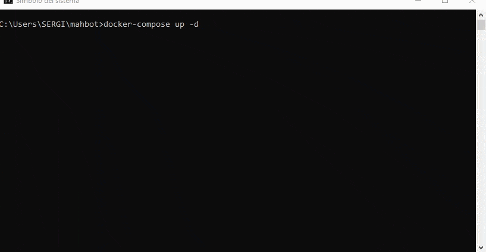
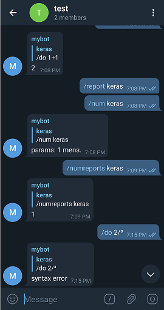

# telegram-bot
Connecting Telegram log chat to MySql using Docker. Automatically save chat history and implements an user report system.

## Prerequisites
- You need [Docker](https://docs.docker.com/desktop/) app installed
- You need a bot and a token [Telegram](https://core.telegram.org/bots#3-how-do-i-create-a-bot)
- This repository inside a folder named XXX (This is the name used in examples below, you could choose whatever)
- Then you need to write the token's bot inside /app/config.json

## Build up
- Open command shell
- Go to repo directory
- write:
``` Bash
  docker-compose up -d
  
  docker exec -it XXX_python_1 sh
  ```
  Now you are inside python service terminal, run Main.py
  ``` Bash
  cd app
  python3 Main.py
  ```
## Build down
``` Bash
  docker-compose down
  ````
## (Optional) Access data
  You could do
  ``` Shell
  apt-get update
  apt-get install default-mysql-server
  ```
  And get access to mysql server bot database with this line (you'll find usera user on ```/app/config.json``` file)
  ```  
  mysql -u [root/usera] -p -h XXX_mysql_1
  ```
  
  ### (Optional) Edit/Create users
  If you like your own user/pass and docker container **is running**, login to mysql server as root
  ``` SQL
  CREATE USER '[your_user_name_here]'@'%' IDENTIFIED WITH mysql_native_password BY 'your_user_password_here';

  GRANT ALL PRIVILEGES ON bot.* TO 'your_user_name_here'@'%';
  ```
  Then you should edit /app/config.json parameters..  you are in terminal so use/install [vim](https://www.vim.org/) or other similar software. Run Main.py
  
  OR
  
  If you dont like sql, you could directly edit ```/mydb/create_user.sql``` and ```/app/config.json``` parameters **before** build this thing up
  ### (Optional) dump database to host
  Run this is terminal an you will get a beautiful backup.sql in the path your are sending this command.
  ```
  docker exec mahbot_mysql_1 /usr/bin/mysqldump -u root --password=root bot > backup.sql
  ```
  
  
  
## Running
- Add your bot to a chat and enjoy!

## Commands
- /report USER
- /numreports USER
- /num USER
- /do MATHEMATIC EXPRESSION

  
  
 Bye!
